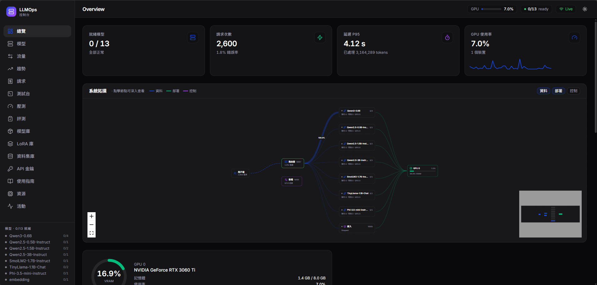
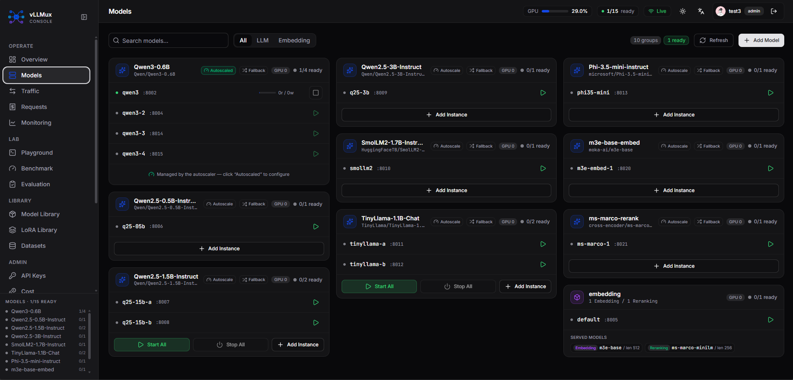

<div align="center">

# LLM-Router-Server-Dashboard
**One-Stop LLM Model Management and Monitoring Platform**

[English](README.md) | [中文](README_zh-CN.md)

</div>

---

## Project Overview

**LLM-Router-Server-Dashboard** is a comprehensive solution for large language model (LLM) deployment and management, providing an intuitive web interface to manage, monitor, and operate multiple LLM model instances.

This project combines a powerful routing server (LLM-Router-Server) with an easy-to-use management interface, enabling you to:
- **Visual Management**: Easily manage multiple models through a web interface
- **Dynamic Control**: Start and stop models in real-time without service restarts
- **Real-time Monitoring**: Monitor model status, GPU utilization, and system information
- **Configuration Management**: Flexibly manage model parameters through YAML configuration files

---

## Key Features

### Core Functionality

- **Multi-Model Management**
  - Support for managing multiple LLM models simultaneously (based on vLLM)
  - Support for Embedding and Reranking models
  - Independent model lifecycle management (start/stop)

- **Visual Control Panel**
  - Real-time display of model running status
  - GPU resource monitoring
  - System resource usage statistics
  - Model configuration viewing and editing

- **Resource Management**
  - GPU device allocation and management
  - Memory usage monitoring
  - Multi-GPU parallel support (Tensor Parallel)

---

## System Requirements

### Hardware Requirements
- **GPU**: NVIDIA GPU (CUDA 12.1+ recommended)
- **Memory**: 16GB+ RAM (depending on model size)
- **Disk**: 50GB+ available space
---

## Quick Start

### Frontend Deployment

#### 1. Build Frontend Container with Docker

```bash
cd frontend/docker
docker build -t llm-router-server-dashboard .
docker-compose -f docker-compose.yaml up -d
```

#### 2. Local Development Mode

```bash
cd frontend
npm install
npm run dev
```

#### 3. Production Build

```bash
cd frontend
npm install
npm run build
```

#### 4. Configure Frontend API Endpoint

Edit `frontend/.env.local`:
```env
VITE_API_BASE_URL=http://localhost:5000
VITE_MODEL_CONTROL_PASSWORD=123
```

#### 5. Customize Server Configuration

Edit `frontend/vite.config.js`:
```javascript
export default defineConfig({
  server: {
    host: '0.0.0.0',  // Allow external access
    port: 5111        // Custom port
  }
})
```

### Backend Deployment

**Important Note**: The backend needs to monitor LLM model status (process management), so it must run in the same container as LLM-Router-Server.

#### 1. Build Container

```bash
cd LLM-Router-Server/docker
docker build -t cuda121-cudnn8-python311 .
docker-compose -f docker-compose.yaml up -d
```

**Ensure docker-compose.yaml exposes necessary ports**:
- `8887`: LLM-Router-Server API
- `5000`: Dashboard Backend API
- Other model ports (e.g., 8002, 8003, etc.)

#### 2. Start Backend in Container

```bash
# Enter the container
docker exec -it <container_id> bash

# Start backend
cd /app/backend
pip install -r requirements.txt
uvicorn main:app --reload --host 0.0.0.0 --port 5000
```

### LLM-Router-Server Deployment

#### 1. Start Router Server in Container

```bash
cd /app/LLM-Router-Server
pip install -r requirements.txt
sh start_router_server.sh /app/backend/config.yaml
```

**Note**: Use `/app/backend/config.yaml` as the unified configuration file to ensure consistency between frontend and backend.

#### 2. Verify Service Status

```bash
# Check router server
curl http://localhost:8887/health

# Check backend API
curl http://localhost:5000/api/status
```

---

## Configuration Guide

### config.yaml Structure

The configuration file is located at `backend/config.yaml` and controls all model startup parameters.

```yaml
# Router server configuration
server:
  host: "0.0.0.0"
  port: 8887
  uvicorn_log_level: "info"

# LLM model configuration
LLM_engines:
  Qwen3-0.6B:                          # Model name (unique identifier)
    model_tag: "Qwen/Qwen3-0.6B"       # HuggingFace model path or local path
    host: "localhost"                   # Service listening address
    port: 8002                          # Service port
    dtype: "float16"                    # Data type (float16/bfloat16/auto)
    max_model_len: 1000                 # Maximum sequence length
    gpu_memory_utilization: 0.6         # GPU memory utilization (0.0-1.0)
    tensor_parallel_size: 1             # Tensor parallel size (multi-GPU)
    cuda_device: 0                      # GPU device specification

# Embedding server configuration (optional)
embedding_server:
  host: "localhost"
  port: 8005
  cuda_device: 1
  
  embedding_models:
    m3e-base:
      model_name: "moka-ai/m3e-base"
      model_path: "./models/embedding_engine/model/embedding_model/m3e-base-model"
      tokenizer_path: "./models/embedding_engine/model/embedding_model/m3e-base-tokenizer"
      max_length: 512
      use_gpu: true
      use_float16: true
  
  reranking_models:
    bge-reranker-large:
      model_name: "BAAI/bge-reranker-large"
      model_path: "./models/embedding_engine/model/reranking_model/bge-reranker-large-model"
      tokenizer_path: "./models/embedding_engine/model/reranking_model/bge-reranker-large-tokenizer"
      max_length: 512
      use_gpu: true
      use_float16: true
```

### Key Parameter Descriptions

| Parameter | Description | Recommended Value |
|------|------|--------|
| `gpu_memory_utilization` | GPU memory usage ratio | 0.6-0.9 |
| `max_model_len` | Maximum context length | Based on model capability |
| `tensor_parallel_size` | Multi-GPU parallelism count | Number of GPUs |
| `dtype` | Inference precision | float16 (faster) / bfloat16 (more stable) |
| `cuda_device` | GPU device number | 0, 1, 2... |

---

## API Documentation

### Backend Management API (Port 5000)

#### 1. Configuration Management

**Get Full Configuration**
```http
GET /api/config
```

**Update Configuration**
```http
PUT /api/config
Content-Type: application/json

{
  "server": {...},
  "LLM_engines": {...}
}
```

#### 2. Model Status

**Get All Model Status**
```http
GET /api/status
```

Response Example:
```json
{
  "Qwen3-0.6B": {
    "status": "running",
    "port": 8002,
    "pid": 12345,
    "gpu": 0
  }
}
```

#### 3. LLM Management

**Start LLM Model**
```http
POST /api/llm/start/{model_name}
```

**Stop LLM Model**
```http
POST /api/llm/stop/{model_name}
```

#### 4. System Information

**Get GPU Information**
```http
GET /api/system/gpu
```

**Get System Resources**
```http
GET /api/system/resources
```

### LLM-Router-Server API

Fully compatible with OpenAI API format.

**Chat Completions**
```http
POST /v1/chat/completions
Content-Type: application/json

{
  "model": "Qwen3-0.6B",
  "messages": [
    {"role": "user", "content": "Hello!"}
  ],
  "stream": true
}
```

**Completions**
```http
POST /v1/completions
Content-Type: application/json

{
  "model": "Qwen3-0.6B",
  "prompt": "Once upon a time",
  "max_tokens": 100
}
```

**Embeddings**
```http
POST /v1/embeddings
Content-Type: application/json

{
  "model": "m3e-base",
  "input": "Hello world"
}
```

---

## Screenshots

### Main Console


### Model Management


---

### Q4: Why can't I start multiple models simultaneously?

**Design Limitation**: The current version requires starting models one at a time to ensure:
- Proper GPU resource allocation
- Avoid memory overflow
- Process management stability

Future versions will optimize parallel startup support.